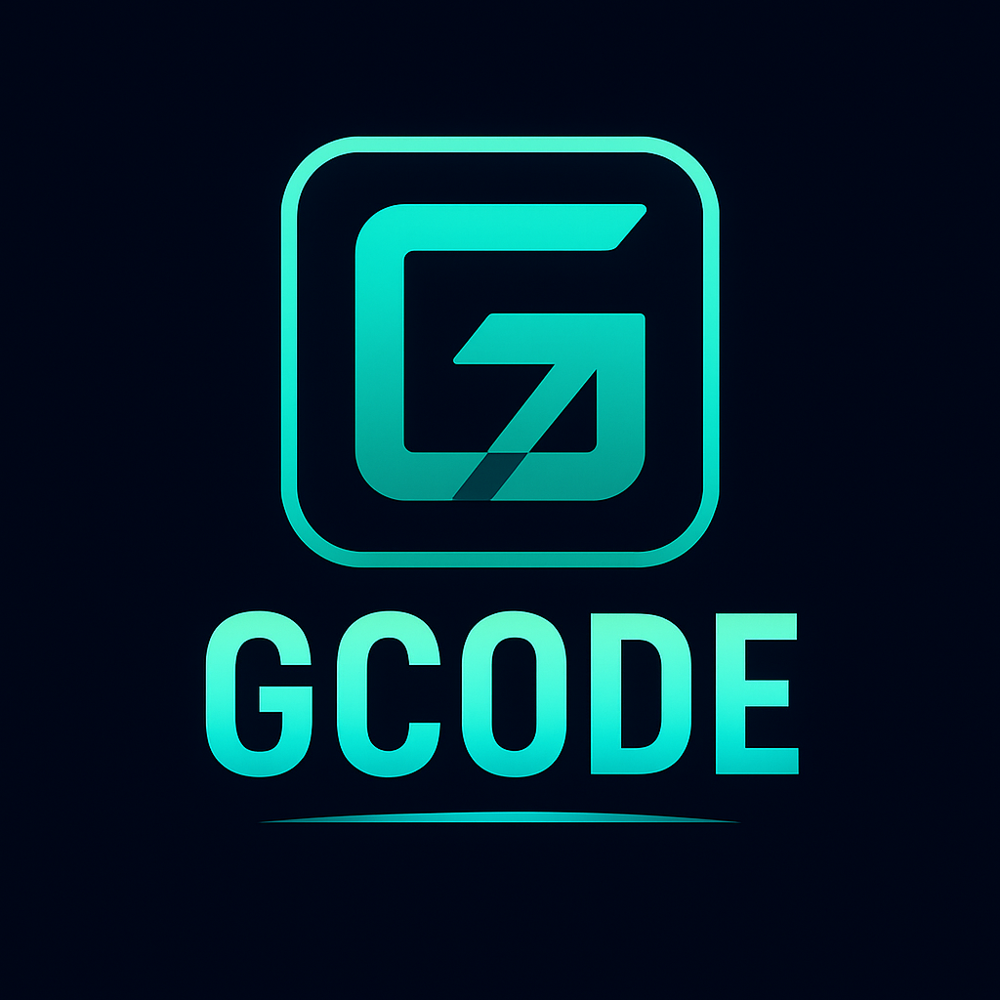

<div align="center">
  

  # gcode - Ghost Code Unicode Library

  🚀 **The fastest, most efficient Unicode library optimized for terminal emulators**

  [](https://ziglang.org/)
  [](https://unicode.org/)
  [](https://github.com/ghostkellz/gcode)
  [](https://github.com/ghostkellz/gcode#performance)
  [](https://opensource.org/licenses/MIT)
</div>

## Overview

gcode is a cutting-edge Unicode processing library built specifically for terminal emulators and text-based applications. Unlike general-purpose Unicode libraries, gcode is laser-focused on the exact Unicode operations terminals need with uncompromising performance.

## Why gcode?

**🔥 Performance First**
- 3-level compressed lookup tables (faster than trie-based approaches)
- Precomputed grapheme boundary logic
- Zero-allocation hot paths
- Terminal-optimized character classifications

**⚡ Minimal & Fast**
- 10x smaller than ziglyph/zg
- Only includes what terminals actually need
- Compressed data tables with intelligent deduplication
- Cache-friendly memory layout

**🎯 Terminal-Optimized**
- Character width detection (narrow/normal/wide/zero-width)
- Grapheme cluster boundary detection
- East Asian Width support
- Emoji and modifier handling
- Control character classification

**🛡️ Modern Design**
- Built for Zig 0.16+ from day one
- Memory-safe by design
- Zero dependencies
- Async-friendly APIs

## Integration

Add gcode to your Zig project:

```bash
zig fetch --save https://github.com/ghostkellz/gcode/archive/main.tar.gz
```

Then in your `build.zig.zon`:

```zig
.dependencies = .{
    .gcode = .{
        .url = "https://github.com/ghostkellz/gcode/archive/main.tar.gz",
        .hash = "...", // Run zig build to get the actual hash
    },
},
```

And in your `build.zig`:

```zig
const gcode = b.dependency("gcode", .{});
exe.root_module.addImport("gcode", gcode.module("gcode"));
```

## Key Features

### Character Properties
```zig
const props = gcode.getProperties('🏳️‍🌈');
// Returns: { .width = 2, .boundary_class = .extended_pictographic }
```

### Grapheme Boundary Detection
```zig
var state = gcode.GraphemeBreakState{};
const is_boundary = gcode.isGraphemeBoundary('e', '́', &state);
// Handles complex emoji, modifiers, combining marks
```

### Optimized Width Calculation
```zig
const width = gcode.getWidth('한'); // Returns: 2 (wide character)
```

### UTF-8/UTF-16 Utilities
```zig
const codepoint = try gcode.utf8.decode("🚀");
const bytes_written = try gcode.utf8.encode(0x1F680, buffer);
```

## Architecture

gcode uses a revolutionary 3-level lookup table system:

1. **Stage 1**: Block index lookup (21-bit → 16-bit)
2. **Stage 2**: Sub-block index lookup (16-bit → 16-bit)
3. **Stage 3**: Final property lookup (16-bit → Properties)

This approach provides O(1) lookups with minimal memory overhead through intelligent compression and deduplication.

## Performance

*Targets for v1.0 release*

| Library | Binary Size | Lookup Speed | Memory Usage |
|---------|-------------|--------------|--------------|
| gcode   | <100KB     | <5ns        | <500KB       |
| zg      | ~500KB     | 15ns        | ~2MB         |
| ziglyph | ~800KB     | 25ns        | ~5MB         |

## Usage

```zig
const gcode = @import("gcode");

// Get character properties
const props = gcode.getProperties('A');
std.debug.print("Width: {}, Class: {}\n", .{ props.width, props.boundary_class });

// Check grapheme boundaries for text cursor movement
var state = gcode.GraphemeBreakState{};
const is_boundary = gcode.isGraphemeBoundary('e', '́', &state);

// Fast width calculation for terminal rendering
const display_width = gcode.stringWidth("Hello 世界!");
```

## Documentation

📚 **Complete documentation available in [docs/](docs/)**

- **[Terminal Integration Guide](docs/terminal-emulator-integration.md)** - Step-by-step integration for terminal emulators
- **[API Reference](docs/api-reference.md)** - Complete API documentation
- **[Performance Guide](docs/performance.md)** - Performance characteristics and optimization
- **[Building Guide](docs/building.md)** - Installation and build instructions
- **[Architecture](docs/architecture.md)** - Internal design and decisions

## Development Status

🚀 **Beta**: Core Unicode functionality complete, ready for terminal integration.
- [x] Extract Ghostshell Unicode system
- [x] Create Unicode data generator framework
- [x] Basic 3-level lookup table implementation
- [x] Zig v0.16 compatibility
- [x] Full Unicode data integration (UnicodeData.txt, EastAsianWidth.txt)
- [x] Complete Unicode case conversion (uppercase/lowercase/titlecase)
- [x] Unicode normalization (NFC/NFD/NFKC/NFKD)
- [x] Production-ready grapheme boundary detection
- [ ] Integration testing with Ghostshell
- [ ] Performance benchmarking vs zg/ziglyph
- [ ] Documentation completion
- [ ] API stabilization for v1.0

## Contributing

gcode is designed to be the Unicode standard for terminal emulators. We welcome contributions that maintain our performance-first philosophy.

## License

MIT License - see LICENSE file for details.

---

**Built with Zig ⚡**