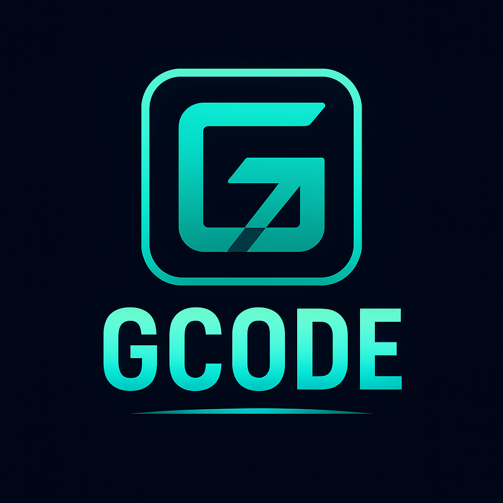

<p align="center">
  
</p>

<h1 align="center">gcode - Ghost Code Unicode Library</h1>

<p align="center">
  <strong>An experimental Unicode library optimized for terminal emulators</strong>
</p>

<p align="center">
  
  
  
  
</p>

---

## Overview

gcode is an experimental Unicode processing library built for terminal emulators,
TUIs, shells, and text-mode applications. It focuses on terminal display width,
grapheme-aware cursor movement, UTF-8 helpers, normalization, and generated
Unicode property tables.

## Disclaimer 
⚠️ **EXPERIMENTAL LIBRARY - FOR LAB/PERSONAL USE** ⚠️
    This is an experimental library under active development. It is 
    intended for research, learning, and personal projects. The API is subject
    to change!

## Why gcode?

**Current focus**
- terminal display-width helpers
- grapheme-aware cursor movement helpers
- UTF-8 validation, decode, and encode helpers
- generated Unicode property tables
- case conversion and UAX #15 normalization (NFC/NFD/NFKC/NFKD)
- UCD 16.0.0 conformance (grapheme, word, normalization, emoji, East Asian Width)

**Experimental / partial areas**
- BiDi class lookup and reordering
- text shaping and advanced script helpers
- benchmark claims versus other libraries

## Integration

Add gcode to your Zig project from a release tag when possible:

```bash
zig fetch --save https://github.com/ghostkellz/gcode/archive/refs/tags/<tag>.tar.gz
```

Then in your `build.zig.zon`:

```zig
.dependencies = .{
    .gcode = .{
        .url = "https://github.com/ghostkellz/gcode/archive/refs/tags/<tag>.tar.gz",
        .hash = "...", // Run zig build to get the actual hash
    },
},
```

And in your `build.zig`:

```zig
const gcode = b.dependency("gcode", .{});
exe.root_module.addImport("gcode", gcode.module("gcode"));
```

## Key Features

### Character Properties
```zig
const props = gcode.getProperties('🏳️‍🌈');
// Returns: { .width = 2, .boundary_class = .extended_pictographic }
```

### Grapheme Boundary Detection
```zig
var state = gcode.GraphemeBreakState{};
const is_boundary = gcode.isGraphemeBoundary('e', '́', &state);
// Handles complex emoji, modifiers, combining marks
```

### Optimized Width Calculation
```zig
const width = gcode.getWidth('한'); // Returns: 2 (wide character)
```

### UTF-8/UTF-16 Utilities
```zig
const codepoint = try gcode.utf8.decode("🚀");
const bytes_written = try gcode.utf8.encode(0x1F680, buffer);
```

## Architecture

gcode uses generated lookup tables for Unicode properties:

1. **Stage 1**: Block index lookup (21-bit → 16-bit)
2. **Stage 2**: Sub-block index lookup (16-bit → 16-bit)
3. **Stage 3**: Final property lookup (16-bit → Properties)

The intended direction is O(1) property lookups with compact generated data. Treat
table size and speed claims as benchmark-backed release evidence, not marketing.

## Performance

*Targets for v1.0 release. These require current benchmark evidence before being
published as claims.*

| Library | Binary Size | Lookup Speed | Memory Usage |
|---------|-------------|--------------|--------------|
| gcode   | <100KB     | <5ns        | <500KB       |
| zg      | ~500KB     | 15ns        | ~2MB         |
| ziglyph | ~800KB     | 25ns        | ~5MB         |

## Usage

```zig
const gcode = @import("gcode");

// Get character properties
const props = gcode.getProperties('A');
std.debug.print("Width: {}, Class: {}\n", .{ props.width, props.boundary_class });

// Check grapheme boundaries for text cursor movement
var state = gcode.GraphemeBreakState{};
const is_boundary = gcode.isGraphemeBoundary('e', '́', &state);

// Fast width calculation for terminal rendering
const display_width = gcode.stringWidth("Hello 世界!");
```

## Documentation

📚 **Documentation starts at [docs/README.md](docs/README.md)**

- **[Quickstart](docs/getting-started/quickstart.md)** - Current terminal-facing examples
- **[API Reference](docs/reference/api.md)** - Exported API grouped by maturity
- **[Support Matrix](docs/reference/support-matrix.md)** - Implemented, partial, experimental, and planned areas
- **[Terminal Integration](docs/guides/terminal-integration.md)** - Width and cursor movement patterns
- **[Architecture](docs/internals/architecture.md)** - Module graph and generated-table flow
- **[Performance Evidence](docs/project/performance.md)** - Benchmark policy and future comparison plan

## Development Status

🚀 **Experimental**: Core terminal-facing helpers exist, but v1.0 API stability and conformance evidence are still in progress.
- [x] Extract Ghostshell Unicode system
- [x] Create Unicode data generator framework
- [x] Basic 3-level lookup table implementation
- [x] Zig v0.17 compatibility
- [x] Unicode data table generation exists
- [x] Case conversion APIs exist
- [x] Normalization APIs exist
- [x] Grapheme boundary APIs exist
- [ ] Official Unicode conformance fixtures
- [ ] Integration testing with Ghostshell
- [ ] Performance benchmarking vs zg/ziglyph
- [ ] API stabilization for v1.0

## Contributing

gcode is intended to become a reliable Unicode foundation for terminal-oriented Zig projects. Contributions should include tests, fixture coverage, and measured performance evidence where relevant.

## License

MIT License - see LICENSE file for details.

---

**Built with Zig ⚡**
