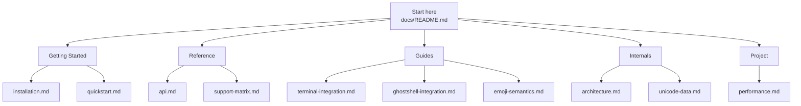
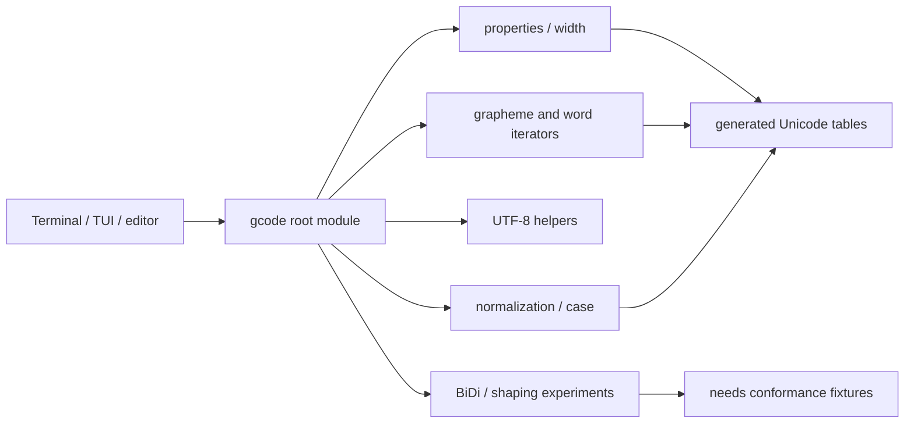
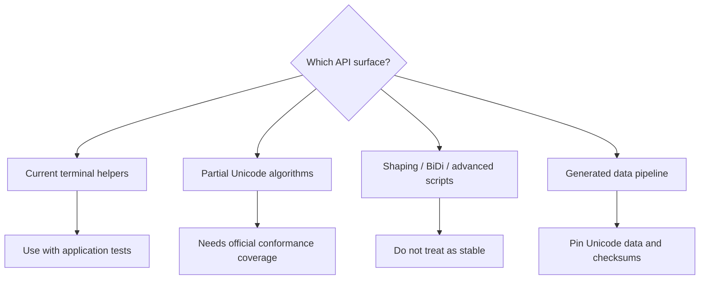

# gcode Documentation

gcode is an experimental terminal-focused Unicode library for Zig. The docs are
organized around current APIs, explicit partial/experimental boundaries, and the
work needed before a v1.0 stability claim.

## Documentation Map



## Runtime Shape



## Stability Flow



## Getting Started

- [Installation](getting-started/installation.md) - Add gcode to a Zig project and run local verification.
- [Quickstart](getting-started/quickstart.md) - Width, UTF-8, grapheme, and cursor examples.

## Reference

- [API Reference](reference/api.md) - Current exported API grouped by maturity.
- [Support Matrix](reference/support-matrix.md) - Implemented, partial, experimental, and planned surfaces.

## Guides

- [Terminal Integration](guides/terminal-integration.md) - Safe terminal width and cursor movement patterns.
- [Ghostshell Integration](guides/ghostshell-integration.md) - How to evaluate gcode in Ghostshell-like terminal workflows.
- [Emoji Semantics](guides/emoji-semantics.md) - What gcode should own versus rendering/font libraries.

## Internals

- [Architecture](internals/architecture.md) - Module graph, table lookup flow, and boundaries.
- [Unicode Data](internals/unicode-data.md) - Data generation and reproducibility goals.

## Project

- [Performance Evidence](project/performance.md) - Benchmark policy and future comparison plan.

## Quick Links

| Area | Path |
|------|------|
| Package metadata | [`../build.zig.zon`](../build.zig.zon) |
| Build script | [`../build.zig`](../build.zig) |
| Root module | [`../src/lib.zig`](../src/lib.zig) |
| Generated tables | [`../src/unicode_tables.zig`](../src/unicode_tables.zig) |
| Task backlog | `../tasks/todo.md` (local ignored task notes) |

## Verification

```bash
zig build
zig build test
zig build test-api-guard
zig build conformance
zig build benchmark
zig build bench-compare
zig build verify
```

gcode is experimental. Treat performance and correctness claims as valid only
when backed by current source, official Unicode fixtures, benchmark output, and
downstream integration tests.
