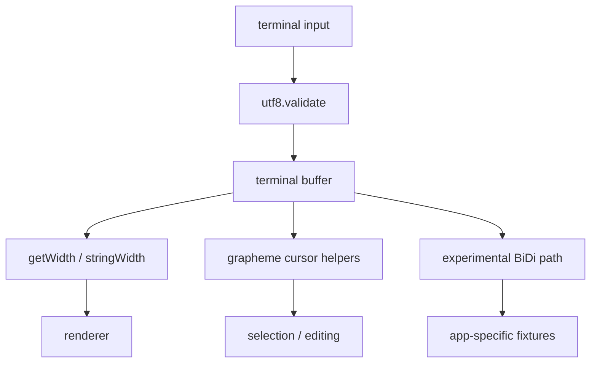

# Ghostshell Integration

This guide describes how to evaluate gcode in a Ghostshell-like terminal stack.
It does not claim gcode is a complete HarfBuzz replacement today.

## Recommended Starting Points

- Use `getWidth` and `stringWidth` for terminal cell layout.
- Use `findNextGrapheme` and `findPreviousGrapheme` for cursor movement.
- Use `graphemeIterator` for selection and deletion boundaries.
- Use UTF-8 validation before accepting untrusted input into the terminal buffer.

## Evaluation Flow

## What To Validate

- prompt editing with combining marks
- cursor movement over emoji clusters
- CJK wrapping and truncation
- selection boundaries in mixed-width text
- invalid UTF-8 recovery behavior
- BiDi behavior only if you opt into experimental APIs

The normal test suite includes Ghostshell-style prompt editing and wrapping
fixtures so cursor and deletion behavior cannot silently split grapheme clusters.

## Not Yet A Stable Claim

Text shaping, BiDi reordering, and advanced script processing still need official
fixture coverage and downstream validation. Keep those paths behind application
feature flags until proven.
