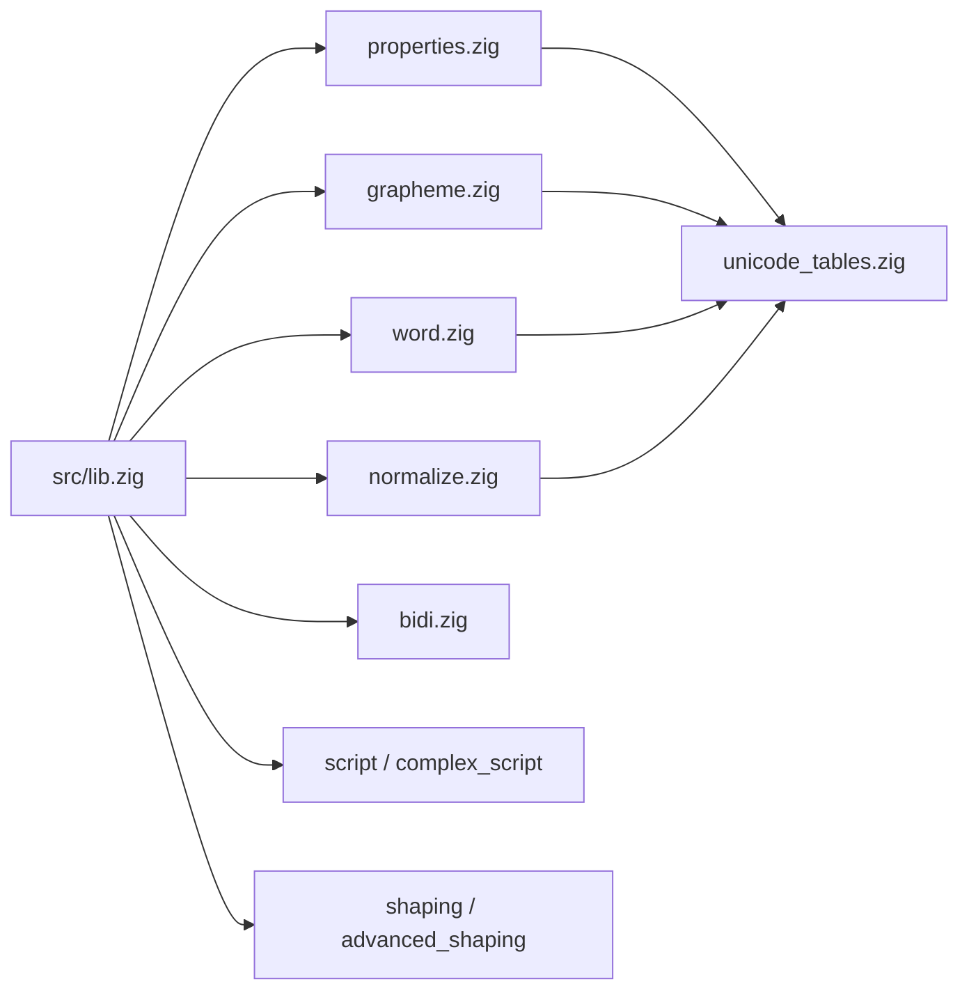
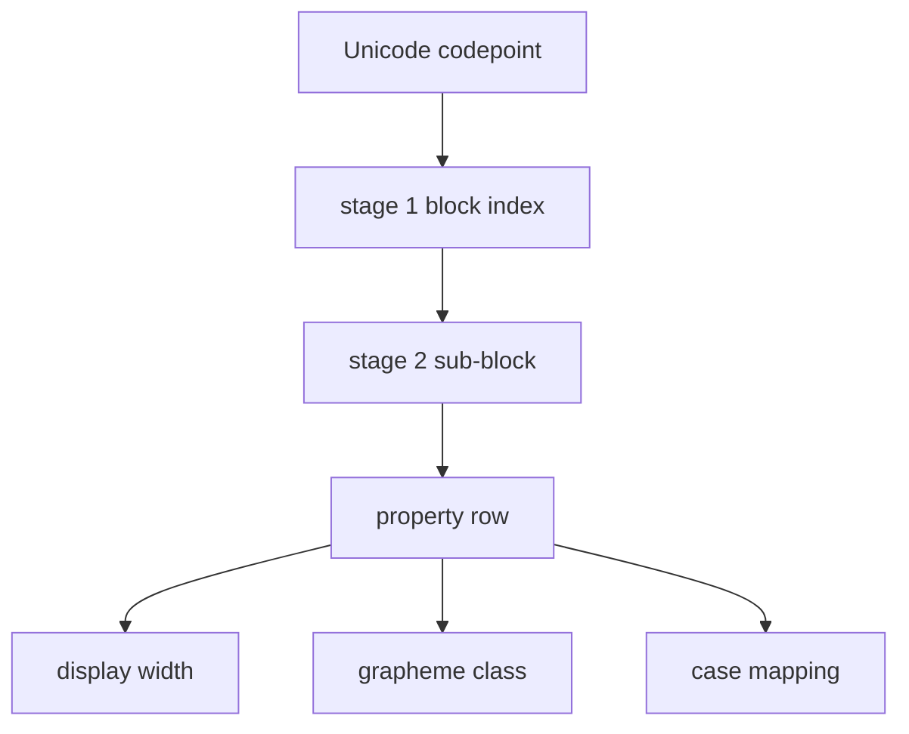
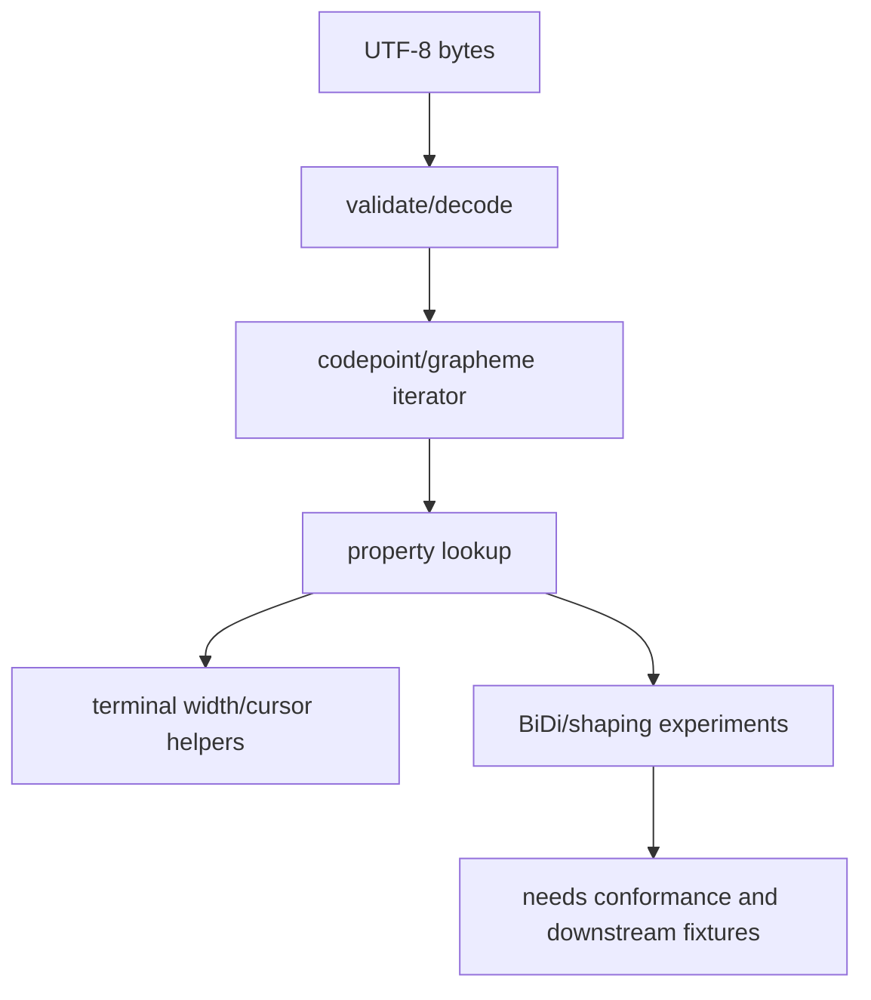

# Architecture

gcode is centered on generated Unicode data tables plus small terminal-oriented
runtime helpers.

## Module Shape

## Lookup Flow

## Text Flow

## Boundaries

- gcode owns Unicode properties, segmentation helpers, terminal width, case, and normalization experiments.
- zfont should own font/glyph/layout/rendering behavior.
- Phantom/Ghostshell should own terminal rendering policy and app-level fallbacks.
- BiDi and shaping exports remain experimental until conformance and integration coverage are stronger.
